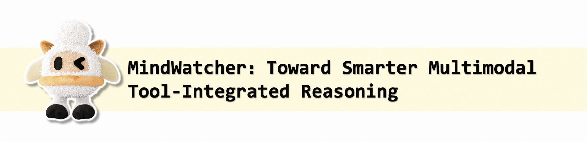
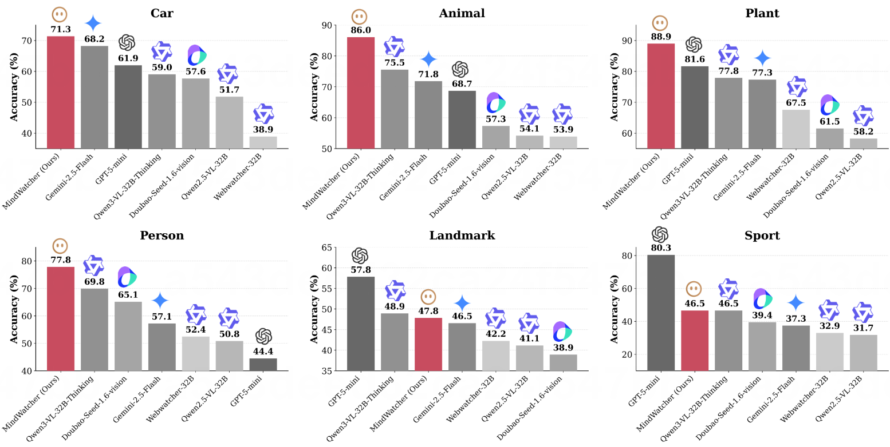

  <picture>
      <!--  -->
      
  </picture>

<!-- 🤗 <a href="https://huggingface.co/spaces/xxx" target="_blank">HuggingFace</a> ｜ -->
<!--  <a href="#" target="_blank">ModelScope</a> |  -->
<!-- 📑 <a href="https://arxiv.org/abs/2025.xxxxx">Paper</a> -->

  <a href="#introduction">Introduction</a> •
  <a href="#news">News</a> •
  <a href="#features">Features</a> •
  <a href="#model-download">Model Download</a> •
  <a href="#performance">Performance</a> •
  <a href="#trajectory-display">Trajectory Display</a> •
  <a href="#citation">Citation</a>

> [!NOTE]
> MindWatcher is a research preview developed by **Li Auto Inc.** The models are designed for multimodal tool-integrated reasoning. For the best experience, we recommend using the 32B model or the distilled 4B variant for resource-constrained environments.

# Introduction

We present **MindWatcher**, a Tool-Integrated Reasoning (TIR) agent capable of autonomous planning, execution, and multimodal perception. Unlike traditional agents that rely on rigid workflows, MindWatcher utilizes **Interleaved Thinking** and **Multimodal Chain-of-Thought (CoT)** to flexibly switch between internal reasoning and external tool invocation at any stage.

MindWatcher addresses the limitations of current LLMs in long-tail knowledge and fine-grained visual perception. It is trained using a novel **Step-wise Normalized GRPO** algorithm and a hybrid reward system, abandoning traditional SFT to avoid "alignment tax" and tool abuse.

MindWatcher demonstrates SOTA performance on the newly constructed **MWE-Bench** and competitive results on MMSearch and SimpleVQA. We also release distilled versions (2B, 3B, 4B) that rival larger baselines.

  

# News

*   **[2025/12/29]** 🚀 **MindWatcher** distilled variants (2B, 3B, 4B) are released! We also open-source the **MWE-Bench** for evaluating multimodal agentic capabilities.

# Features

- 🧠 **Interleaved Thinking & Multimodal CoT**: The model models the reasoning process as an MDP, allowing it to "think with images" and interleave `<think>` and `<tool_call>` tokens dynamically.
- 🛠️ **Comprehensive Multimodal Toolset**: Equipped with expert tools including **Region Cropping/Zooming**, **Object Grounding & Visual Search**, **External Text Retrieval**, **Webpage Content Extraction**, and a **Local Code Interpreter**.
- ⚡ **Step-wise Normalized GRPO**: A customized RL algorithm that normalizes advantages based on action segments rather than global tokens, ensuring balanced supervision for both short tool commands and long reasoning chains.
- 📊 **MWE-Bench**: A new benchmark covering 6 categories (Vehicle, Animal, Plant, Person, Landmark, Sports) constructed via a rigorous pipeline to evaluate TIR agents.
- 📉 **Efficient Distillation**: We successfully distilled the capabilities of the 32B model into 2B, 3B, and 4B models, proving that strong tool-use capabilities can bridge the parameter gap.

# Model Download
We are about to open-source the distilled model weights.
<!-- You can download the models directly from HuggingFace. -->

<!-- | Model | Parameters | Description | Download |
| :--- | :---: | :--- | :---: |
| **MindWatcher-4B** | 4B | Distilled from 32B, based on Qwen3-VL-4B-Thinking. | [🤗 HuggingFace](#) |
| **MindWatcher-3B** | 3B | Distilled from 32B, based on Qwen2.5-VL-3B-Instruct. | [🤗 HuggingFace](#) |
| **MindWatcher-2B** | 2B | Distilled from 32B, based on Qwen3-VL-2B-Thinking. | [🤗 HuggingFace](#) | -->

# Performance

MindWatcher achieves state-of-the-art performance on the **MWE-Bench**, significantly outperforming closed-source commercial models like Gemini 2.5 Flash and GPT-5 mini in agentic settings.

### MWE-Bench Results (ReAct/Agent Mode)

| Method | Car | Animal | Plant | Person | Landmark | Sport | **Avg.** |
| :--- | :---: | :---: | :---: | :---: | :---: | :---: | :---: |
| GPT-5 mini | 61.93 | 68.66 | 81.61 | 44.44 | **57.78** | **80.28** | 69.91 |
| Qwen3-VL 32B Thinking | 58.98 | 75.5 | 77.83 | 69.84 | 48.89 | 46.48 | 66.95 |
| **MindWatcher-4B** | 56.03 | 84.62 | 87.66 | 68.25 | 41.11 | 36.62 | 69.63 |
| **MindWatcher-32B** | **71.31** | **86.04** | **88.92** | **77.78** | 47.78 | 46.48 | **75.35** |

# Contact

For communications, please contact `chenjiawei13@lixiang.com`.
